

رزومه لجستیکی پیمان مجیدی
===================

## دستگاه پروفایلر

این دستگاه در جهان با نام DWS شناخته میشود. DWS سرنام عبارات Dimensioning, Weighing, Scanning است که توانایی ابعادگیری، وزنگیری و اسکن بارکد روی بسته را در حال حرکت دارد. در سیستم های سورتینگ این دستگاه به عنوان قلب تپنده سیستم، عمل میکند. بسته ها پس از عبور از تونل پروفایلر هویت دار میشوند و در ادامه مسیر به گیت مربوط به خودت هدایت میشوند.

دستگاه پروفایلر شرکت RSA یک ماژول 3 متری بوده که از 3 نوارنقاله یا conveyor یک متری تشکیل شده است. بسته ها توسط اپراتور روی کانوایر ابتدایی قرارگرفته و دستگاه ریتم بسته های ورودی را تنظیم میکنم به طوری که هر بار تنها یک بسته روی کانوایر وزنگیری باشد. کانوایر سوم بسته را به اپراتوری که در انتهای خط قرار دارد تحویل میدهد و مقصد را به او گزارش میدهد.

### اسکن بارکد با پردازش تصویر در فاز Scanning

در اولین ورژن پروفایلر طراحی شده در شرکت؛ از 12 دوربین IP Camera جهت اسکن بارکد طرفین بسته استفاده شد. بدین صورت که 2 دوربین در چپ، 2 دوربین در راست، 2 دوربین در جهت بالا و 2 دوربین مسلط به سر و ته بسته (Rear/Tail) نصب شد. یک سنسور خطی در مرکز تونل حضور بسته جدید را تشخیص میدهد. مادامی که سنسور در حالت تحریک (trig) قرار دارد دوربین ها فعال شده و از بسته عکس تهیه میکنند. از آنجایی که تنها یکی از طرفین شامل بارکد است در اولین فاز طرفین اضافه حذف میشوند. اگر متوسط اندازه تصویر هر دوربین را 800KB در نظر بگیریم در مجموع حدود 10 MB نرخ ورودی خواهد بود که لازم بود در زیرساخت IT لحاظ گردد. بارکدهای خوابیده در حرکت بدون اشکال بودند و بارکدهای ایستاده دچار یک دنباله (Tail یا حالت موجی شکل) میشدند که از چالش های کار بود که با train کردن سیستم، رفته رفته بهبود یافت. با توجه به نرخ پردازش بالا و محدودیت سرعت خط تا 1m/s در ورژن بعدی بارکد اسکنرهای صنعتی جایگزین شد.

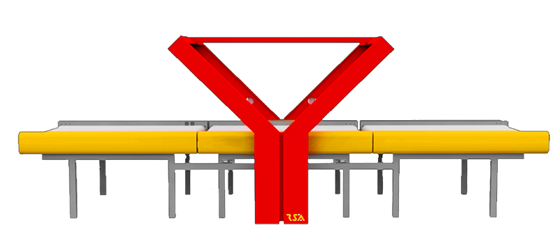
تصویر 1: دستگاه پروفایلر محصول شرکت RSA

### وزنگیری در حرکت یا Weigh in motion

وزنگیری در WIM را نباید معادل Check weigher ها دانست. از CW معمولا در خط تولیدها جهت مغایرت‌گیری و خارج کردن بسته ها با وزن بیشتر یا کمتر استفاده میشود. در این حالت رنج تغییرات وزنی و ابعادی محدود است و چالش کمتری دارد.

در Weigh in motion شرکت RSA، دامنه وزن ورودی از 100g تا 30kg لحاظ شده و با توجه به ابعاد بسته که از 10cm تا 100cm مجاز است بایستی از 4 عدد loadcell در اطراف کانوایر وزنگیری استفاده شود. جهت بهینه تر شدن وزن از انواع فیلترهای نرم‌افزاری و الگوریتم های ویژه WIM استفاده شد. در این ماژول بایستی ضربه هایی که از کف سالن به دستگاه وارد میشود خنثی شود. دستگاه های گرماتاب در زمستان، باد کولر در تابستان و حتی نویز موجود در برق که روی خروجی وزنگیری تاثیرگذار هستتند در پیاده
سازی این شرکت خنثی شد. جهت داشتن بهترین نتیجه در هربار خروج بسته از ماژول؛ دستگاه با حذف وزن خود سازه، هربار کالیبره شده و همینطور در ابتدای هر روز با وزنه های معیار مجددا صحت سنجی انجام میشود. در حال حاضر دقت وزنگیری در پروفایلر +/- 1% از وزن خود بسته است.

### نمایش فرایند و اتوماسیون

از طریق یک API با شرکت های طرف قرارداد؛ &quot;بارکد&quot;اسکن شده روی بسته به &quot;مقصد&quot;بسته تبدیل میشود. در این فاز یک نمایشگر &quot;مقصد&quot;بسته را نمایش داده همچنین یک ربات تبدیل متن به گفتار (TTS) نام مقصد را اعلام میکند. یک عکس از بسته به همراه ابعاد، وزن بسته و تاریخ و زمان سورت در دیتابیس ذخیره شده و نتیجه سورت مجددا از طریق API به شرکت طرف قرارداد ارسال میگردد و وضعیت بسته از &quot;ورود به انبار&quot; به &quot;سورت شده&quot; تغییر میکند.

در این فاز وزن محاسبه ای بسته با وزن ادعا شده از طرف شرکت ارسال کننده مقایسه شده و امکان مغایرت گیری وجود دارد. در صورتی که کالا شکستنی باشد و یا در دسته‌ی dangerous goods قرارداشته باشد این مهم به کاربر اطلاع داده میشود.

از طریق سامانه‌ی &quot;کالایاب&quot; امکان پیگیری و استعلام وضعیت بسته وجود دارد، در صورتی که بسته دارای آسیب‌دیدگی باشد مشخص میشود که در لحظه ورود به انبار کالا دچار اشکال بوده و یا پس از خروج از انبار صدمه دیده است. یک ربات تلگرامی در اختیار مسئول انبار قرار دارد تا در هر ساعت از شبانه روز با ارسال بارکد وضعیت بسته را استعلام کند.

### ابعادگیری یا Dimensioning

در حال حاضر ابعاد گیری تنها به صورت Cubic و با نصب چند سنسور خطی انجام میشود. جهت داشتن بهترین خروجی یک ماژول Aligner طراحی شد که بسته را به یکی از لبه های کانوایر هدایت میکند. از خروجی ابعاد این دستگاه برای تخمین تعداد بسته های یک ترولی و چیدمان بهینه داخل قفسه های حمل(ULD) استفاده میشود. همچنین به عنوان سورس دستگاه Sequencer بکار می رود که از دیگر محصولات این شرکت است.

## سورتر چیست?

سورتر سیستم مرتب ساز و تفکیک کننده کالا (Sorter) با شناسایی و تفکیک انواع محصولات، بسته ها و کالاها ، امکان مدیریت موجودی ها را به بهترین شکل ممکن فراهم می سازد. این سیستم به گونه ای طراحی میگردد که براحتی می تواند کالاها و مرسولات مختلف را بر مبنای شاخص های مختلف که قابل تنظیم می باشد همانند وزن، حجم(ابعاد) و یا بارکد (خط نماد) شناسایی و از یکدیگر تفکیک نماید.

این محصول قابلیت اتصال به خط تولید و یا مبادی ورودی و خروجی انبار به هنگام تخلیه و بارگیری را دارا می باشد، ضمن آنکه تلفیق این محصول با سیستم های جابجایی کالا و مواد (Material Handling) کارآیی و بهره وری سیستم را دو چندان می سازد.

با استفاده از این دستگاه، مدیریت،کنترل و نظارت بر انواع کالاها و اقلام فراهم شده و تفکیک و جدا سازی تمامی محصولات و کالاها در کمترین زمان ممکن بدون دخالت نیروی انسانی انجام می پذیرد.

به هر میزان که تنوع و حجم کالاهای موجود در یک انبار بیشتر باشد و گردش کالاها در آن زیادتر باشد، نیاز به این سیستم و لزوم بکارگیری آن خصوصا در مبادی ورودی و خروجی انبارها بیشتر احساس می شود.

استفاده از سیستم تفکیک کننده محصولات و مرسولات، در انبارهایی که با تعداد زیادی تامین کننده از یک سو و حجم بالایی از مشتریان و خریداران از سوی دیگر در ارتباطند همانند شرکت های فروش اینترنتی کالا و محصولات و همچنین شرکت های پستی به شدت توصیه می گردد.

## اولین سورتینگ سنتر ایران

پس از اینکه طراحی و ساخت دستگاه پروفایلر در شرکت با موفقیت انجام شد و دستگاه در شرایط واقعی سناریوهای تست های خود را پاس کرد به سفارش شرکت &quot;ماهکس&quot;اولین مرکز پردازش کالا کلید خورد.

### مرکز سورت ماهکس با تکنولوژی Rota

Rota کوتاه شده‌ی عبارت Rotationاست. در Rota که در دسته‌بندی سولوشن های Side arm قرار میگیرد یک بازو حین چرخش بسته را به گرویتی مقابل خود هدایت میکند. مزیت Rota به سولوشن های مشابه این است که پس از یک نیم دور، ماژول مجددا آماده به کار است در صورتی که در ساید آرم لازم است مسیر رفته را برگردد یا با یک نیم دور هرز به محل قبلی باز گردد. در این پروژه یک اپراتور در ابتدای خط، سورتینگ را تغذیه میکند. بسته پس از عبور از دستگاه پروفایلر هویت دار شده و به وسیله یک Rota به گرویتی خود هدایت میشوند.

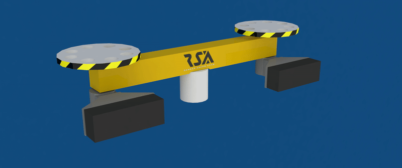
تصویر2: یک عدد ماژول Rota محصول شرکت RSA

تفکیک شهری و درون شهری روزانه تا 35هزار بسته در روز و ارسال به اقصی نقاط کشور با ناوگان حمل نقل زمینی و هوایی ماهکس به صورت کاملا مکانیزه از مشخصات این پروژه است. مرکز سورت ماهکس از 15 فروردین سال 97 آغاز به کار کرد و اکنون در شعبه فتح 13 استان تهران این شرکت زیر بار است.

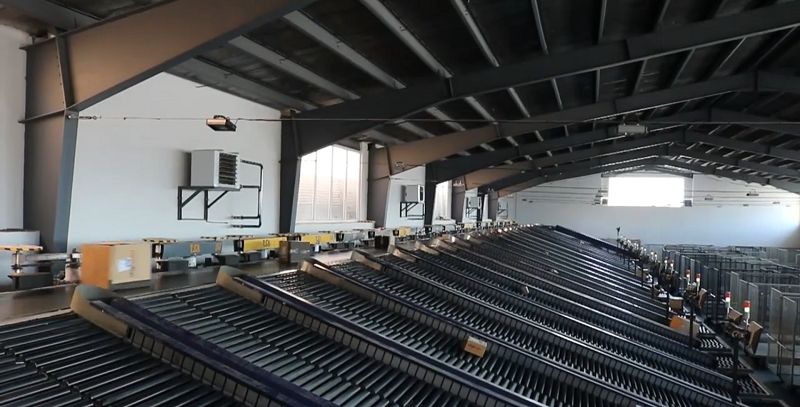
تصویر 3: نمایی از پروژه روتا – مرکز پردازش کالا

پرتوتایپ کلان-پروژه سالن Crossbelt:

یکی از آخرین تکنولوژی های سورتینگ در جهان سولوشن کراس-بلت میباشد که تعداد محدودی از کشورهای جهان دانش ساخت و اجرای آنرا دارا میباشند. در این روش تعداد زیادی کالسکه در حال چرخش به دور سالن هستند. کالسکه ها توانایی تغذیه از هر دو جهت چپ و راست و تخلیه به صورت درون-ریز و برون-ریز را دارا هستند.

از آنجایی که کالسکه‌ها در یک مدار و در طول سالن در حرکت هستند و خود کالسکه امکان تخلیه بسته به طرفین چپ و راست را داراست به آن cross میگویند (+(.

پیاده سازی این پروژه در ایران به مراتب پیچیده تر است. چرا که تجهیزات مورد نیاز ساخت کراس از جمله رولیک موتور و انواع تجهیزات شبکه contactless به دلیل تحریم ها در ایران در دسترس نیست. لذا مهندسین مجموعه راهکارسازان شخصا دست به کار شده و کلیه ملزومات را از base طراحی کردند یا از تجهیزات موجود در بازار داخلی استفاده کردند.

این پروژه در بهمن 98 در ابعاد کوچک تر و به صورت پرتوتایپ پیاده سازی شد و زیر تست رفت. بالاترین چالش این پروژه در بخش فیدینگ یا تغذیه کالسکه ها بود که در فاز پرتوتایپ عملیاتی شد و شرکت به دانش فنی آن دست پیدا کرد.

## سورتینگ لایتینگ شرکت تیپاکس

شرکت تیپاکس یکی از قدیمیترین شرکت های ترابری و ارسال بار در ایران، جهت راه‌اندازی 15هاب اصلی خود در سراسر کشور نیاز به یک سولوشن سورت و تفکیک داشت که به شرکت راهکارسازان مراجعه کرد. این شرکت به دنبال یک سولوشن ارزان قیمتی ولی قابل اعتماد بود که در آینده به سادگی قابل ارتقاء باشد.

از اینرو سولوشن سورتینگ لایتینگ خطی با تعریف سکشن‌های فرضی تعریف شد. اساس این سورتینگ ترتیبی بوده و لازم است تا انتهای مسیر ترتیب ورود بسته ها پیش از رسیدن به گیت مربوطه حفظ شود. اگر در بین راه، بسته توسط اپراتور اشتباهی برداشته شود، سورتینگ بهم ریخته و تا زمان تشخیص خرابی کلیه بسته ها به گیت اشتباه هدایت میشوند. لذا جهت اصلاح این موضوع، کانوایر اصلی به تعدادی سکشن فرضی تقسیم بندی میشود. بسته در حین ورود به یکی از سکشنهای لاجیکال تخصیص داده میشود.

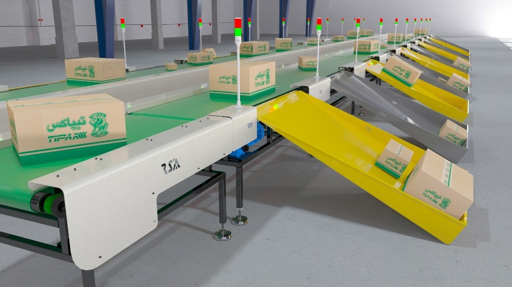
تصویر4: مدل سه بعدی پروژه تیپاکس

در این روش بسته ها شمارش نشده و سورتینگ بر اساس سکشن های لاجیکال انجام میشود. همچنین از شمارش بسته ها برای تشخیص و ترفیع خطا و چک پوینت کمکی استفاده میشود. در مقابل هر گیت یکLED Tower نصب شده که با رسیدن سکشن به گیت مربوطه، چراغ سبز آن روشن میشود. این سکشن ها فرضی هستند و قابل رویت نیستند. به طور کلی با این روش تمامی کانوایرهای انتقال با هر طولی قابلیت تبدیل شدن به سورتینگ لایتینگ خطی را دارد، حتی کانوایر های که پیشتر در سالن ها نصب میباشد. این روش سورتینگ، مقرون به صرفه و قابل اعتماد است.

## کلان-پروژه سالن Crossbelt

پروژه مرکز پردازش کالای شرکت ماهکس با ظرفیت 10هزار بسته در ساعت و حدود 150گیت خروجی در شعبه فتح شرکت ماهکس کلید خورد.

این مرکز میتواند بر حسب &quot;استان&quot;های مختلف کشور، بر حسب &quot;مناطق مختلف شهر تهران&quot;، بر حسب &quot;مناطق زمانی&quot; (تاریخ گذشته، حال، آینده نزدیک، آینده دور و مرجوعی)، برحسب داده های ترافیکی و چیدمان داخل تراک ها و هر فاکتور دیگری که میتواند مبنای تفکیک قرار گیرد؛ سورت بسته های ورودی را انجام دهد.

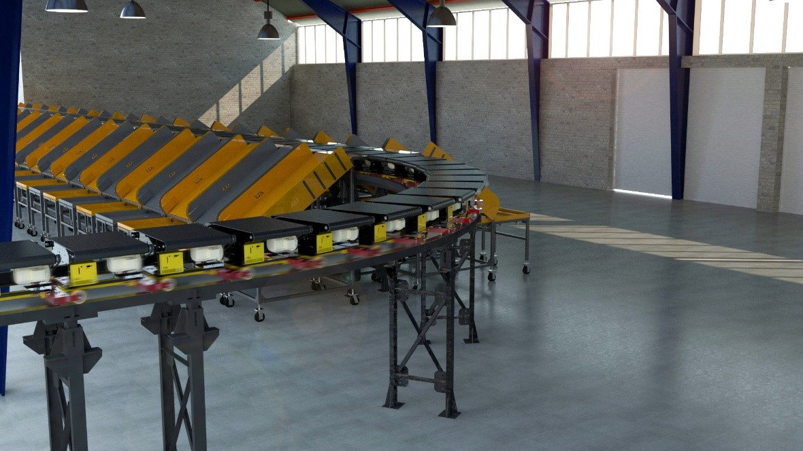
تصویر 5: مدل سه بعدی پروژه کراس-بلت

از طراحی مکانیک، تا ساخت، لاجیک و کنترل تا برنامه نویسی و اتوماسیون همگی توسط مهندسین شرکت RSA انجام شد.

## بایگانی هوشمند

سیستم بایگانی هوشمند (Smart Archive) که دارای گواهی ثبت اختراع جهانی می باشد از جمله محصولات جدید و مدرن در حوزه نگهداری و بایگانی اسناد، مدارک، پرونده ها، زونکن و سایر اقلام آرشیوی می باشد که در تمامی فضاهای اداری و صنعتی قابل استفاده می باشد.

این سیستم با قابلیت های منحصر به فرد خود، علاوه بر افزایش سرعت و دقت عملیات کاری، با یکپارچه سازی تمامی فرآیند های بایگانی، سطح نوینی از مکانیزاسیون و اتوماسیون را فراهم می آورد.

طراحی دستگاه بایگانی هوشمند به گونه ای می باشد که گذاشت و برداشت زونکن یا اسناد و مدارک در داخل آن بصورت مکانیزه و از طریق فرامین صادره توسط نرم افزارهای موجود در محل که به دستگاه متصل می گردند، به راحتی انجام می پذیرد. در این سیستم میزان و سطح دسترسی افراد با استفاده از مکانیزم هایی همچون اثر انگشت، تشخیص چهره و کارت تردد قابل تعریف می باشد که تاثیر چشمگیری در افزایش امنیت سیستم دارد. ضمن آنکه فراخوان پرونده ها و مدارک مورد نیاز از طریق سیستم تشخیص صدا نیز فراهم گردیده است.

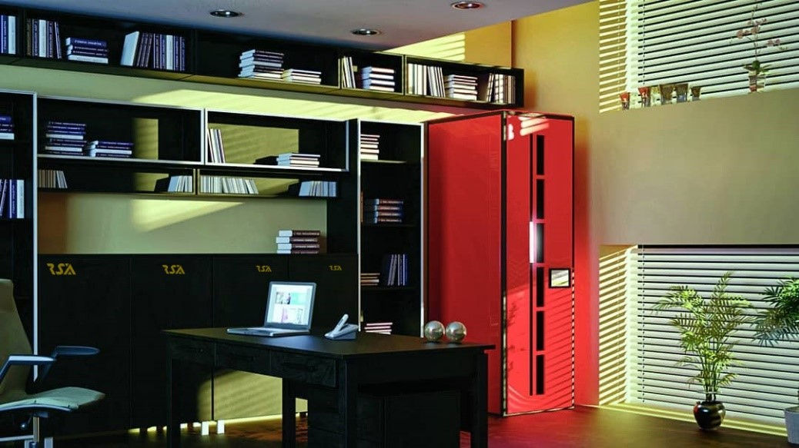
تصویر6: مدل سه بعدی از انبار بایگانی هوشمند

یکی از ویژگی های اختصاصی دستگاه بایگانی هوشمند، قابلیت گسترش (Expandable) و افزایش ظرفیت آن بصورت یکپارچه می باشد، بدین معنی که در کنار دستگاه قبلی به راحتی و با کمترین هزینه ممکن به تعداد دلخواه می توان دستگاه اضافه نمود و بعنوان یک سیستم واحد از آن استفاده نمود.

سیستم بایگانی هوشمند با بکارگیری تکنولوژی های جدید همچون RFID و بارکد، علاوه بر مدیریت بهینه اسناد و مدارک و همچنین کنترل و نظارت بیشتر، امکان تهیه گزارشات مدیریتی به روز و در لحظه (Online) را نیز فراهم می سازد.

دستگاه های بایگانی هوشمند با فراهم نمودن تمامی زیرساخت های مورد نیاز، عملکردی مشابه یک انبار مکانیزه جهت بایگانی اسناد و مدارک را داشته و قابلیت انطباق و بکارگیری در تمامی فضاها خصوصا محیط های اداری و سازمانی را دارا می باشند.

از مشتریان این دستگاه در حال حاضر میتوان به شرکت ملی حفاری ایران در اهواز، بنیاد شهید تهران و مجموعه تکاک اشاره کرد و سفارش های جدید دیگری نیز ثبت شده است.

کانوایر فرودگاهی مهرآباد:

این پروژه نمونه ای از دستگاه پروفایلر است که پشت دستگاه x-ray قرار میگیرد. تفاوت آن با پروفایلر در عرض بیشتر سازه و تحمل وزن بیشتر آن است. این دستگاه به سفارش cargo فرودگاه مهرآباد طراحی و ساخته شد.

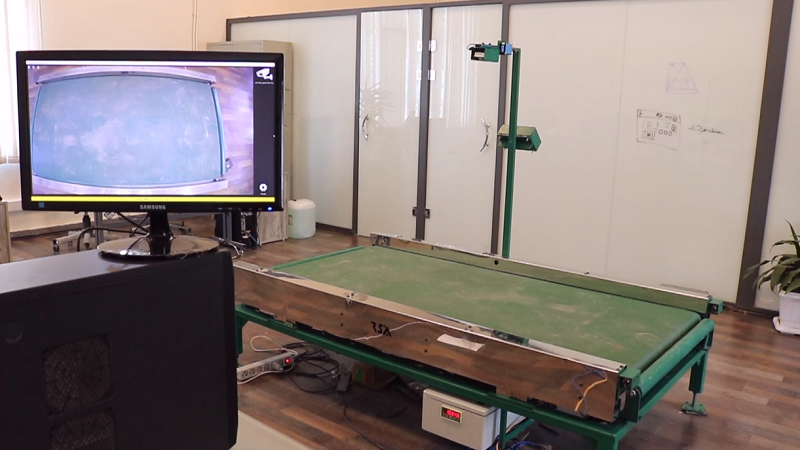
تصویر: کانوایر فرودگاهی مهرآباد

سولوشن Sequencer:

از ماژول Sequencer جهت به صف کردن کالاها بر حسب وزن، ابعاد و چیدمان داخل تراک ها استفاده میشود. زمانی که یک تراک از درب انبار خارج میشود بر اساس ترافیک و مسیر انتخابی توسط راننده ترتیب نقاط تحویلی متغیر است. بهتر است کالاهایی در ابتدای قسمت بار قرارگیرند که زودتر موعد تحویل آنها میرسد.

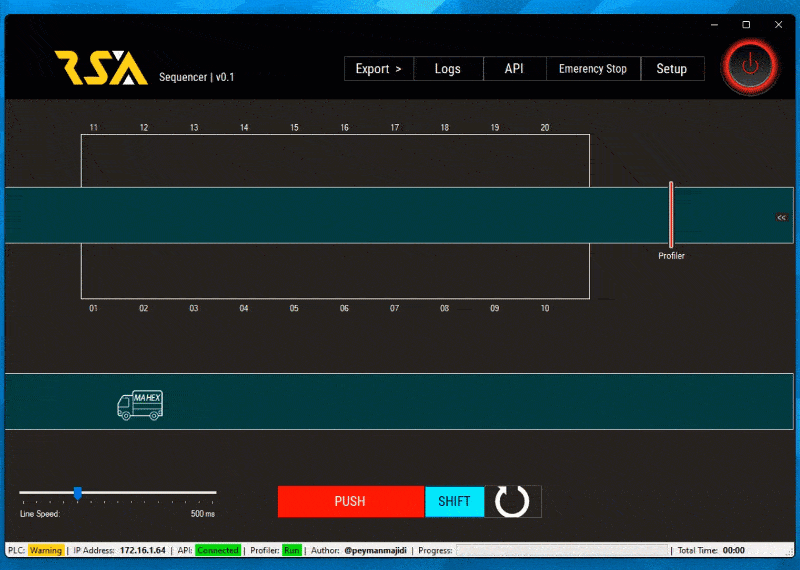
تصویر7: طرز کار ماژول Sequencer

پس از اینکه سورت کالاها انجام شد دستگاه Sequencer با تبدیل آدرسها به عرض و طول جغرافیایی و یک API بهینه ترین حالت را تعیین کرده و ترتیب چیدمان کالاها در داخل تراک را مشخص میکند. همچنین این دستگاه میتواند بهینه ترین حالت چیدمان کالاها در یک قفسه حمل (ULD) را مشخص کند؛ به طوری که مراقب است کالاهای شکستنی یا DG در بالا قرار گیرد.

تعمیر نگهداری پیشگیرانه یا Preventive Maintenance

کلیه پروژه ها شامل یک بسته نرم افزاری ویژه تعمیر و نگهداری هستند. این شیوه نگه داری پیشگیرانه بوده و ROI کلیه قطعات در سطح مکانیک و برق به صورت لاگ های سیستمی ذخیره میشوند. این بسته شامل برنامه ویژه سیستم عامل اندروید و مایکروسافت ویندوز می‌شود.

سایر محصولات شرکت:

1. سولوشن سورت Pop-up

هدایت بسته از خط اصلی به انشعاب های 90 درجه

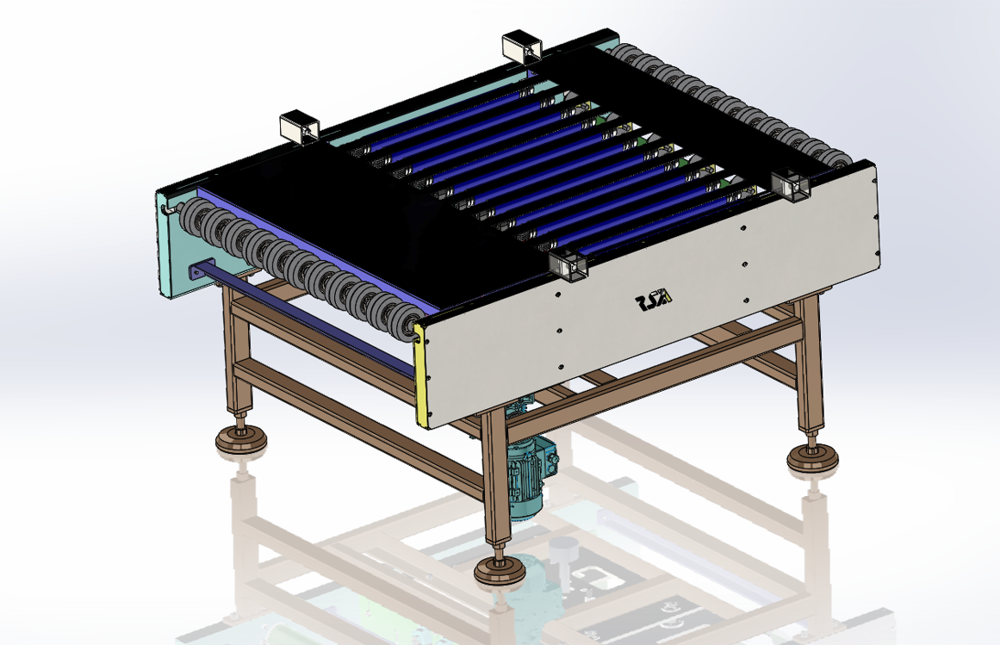
شکل الف: سورتر Pop-up

1. Bulk Tipper

جهت تخلیه یکجای قفسه های حمل بسته ها (ULD) به صورت کنترل شده

از این ماژول در ابتدای سولوشن Singulator جهت جدا کردن بسته ها از یکدیگر به صورت مکانیزه و تمام-اتوماتیک استفاده میشود.

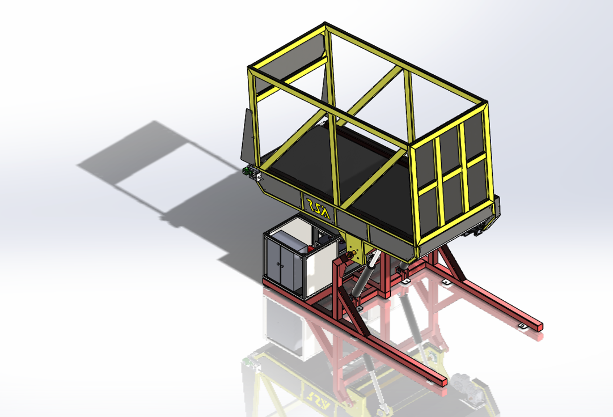
شکل ب:Bulk Tipper

1. Scissor Lift

جهت تخلیه ULD از تراک و سوار کردن مجدد ULD استفاده میگردد

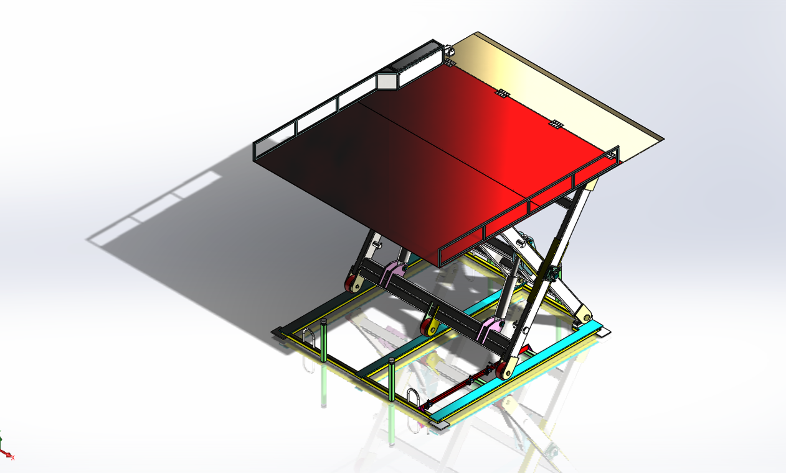
شکل ج: Scissor Lift

1. Stripe Conveyor

جهت پیوست بسته از فیدر به داخل کالسکه های کراس-بلت و یا جهت هدایت بسته از زاویه 30 تا 45 درجه به زاویه 90 درجه

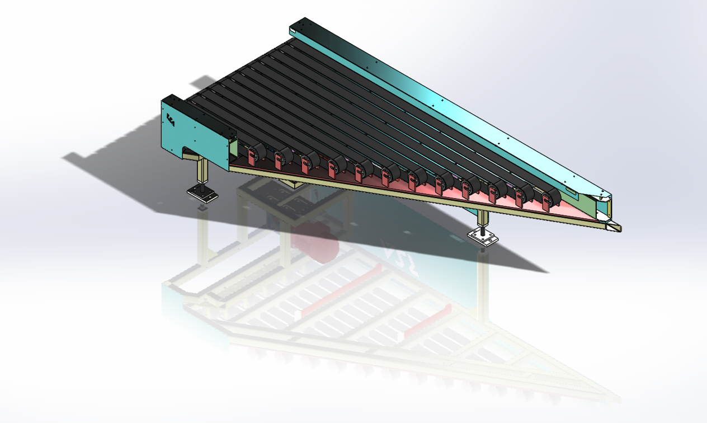
شکل د: Stripe Conveyor

1. Divertor

هدایت بسته از خط اصلی به انشعاب های 45 درجه

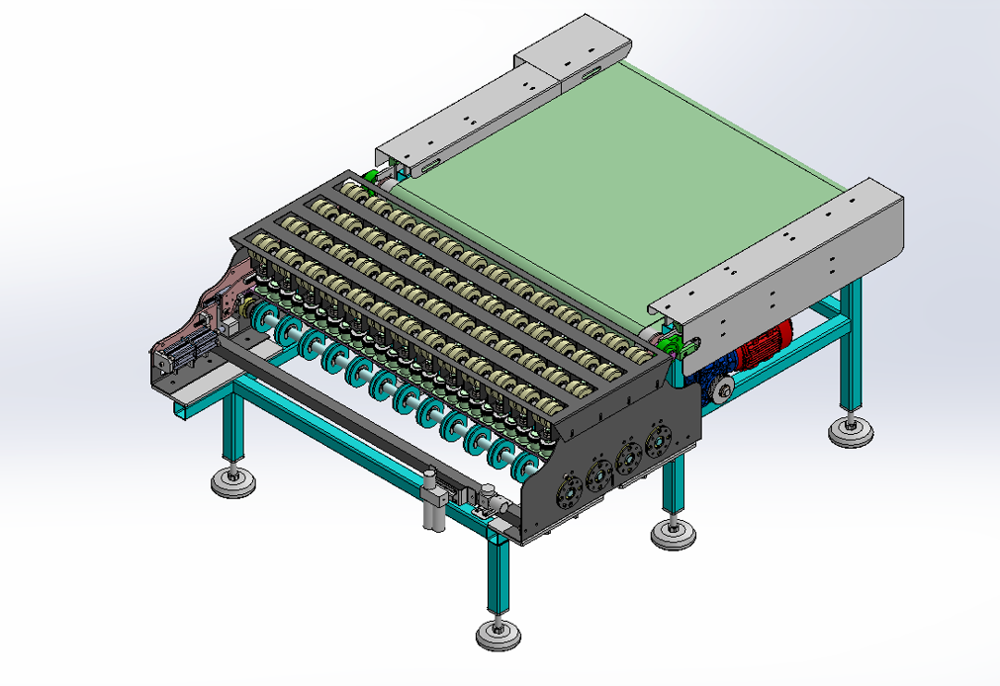
شکل هـ: Divertor

1. بالابر قابل حمل هیدرولیکی

جهت سوار کردن و پیاده کردن ULD به داخل تراک ها

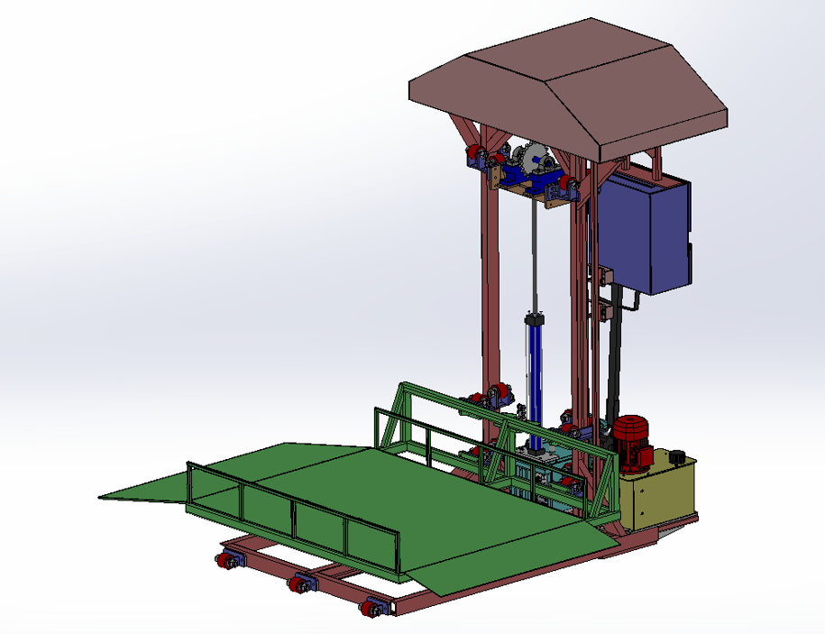
شکل ی: بالابر قابل حمل هیدرولیکی

شرکتهایی که جهت دریافت مشاوره و سولوشن فنی به راهکارسازان مراجعه کرده اند یا این شرکت از آنها بازدید داشته:

1. شرکت دیجیکالا در انبار Fulfillment دانش
2. شرکت دیجیکالا در انبار Large Item بادامک
3. شرکت افق کوروش جهت ارائه سولوشن در انبار O-Kala
4. شرکت تلاونگ در شهرک صنعتی نصیر آباد
5. شرکت &quot;تخم مرغ مرکز&quot;جهت سورت و تشخیص تخم مرغ های معیوب
6. ...

تاریخ تنظیم: 
<kbd>00-ABAN-01</kbd>

